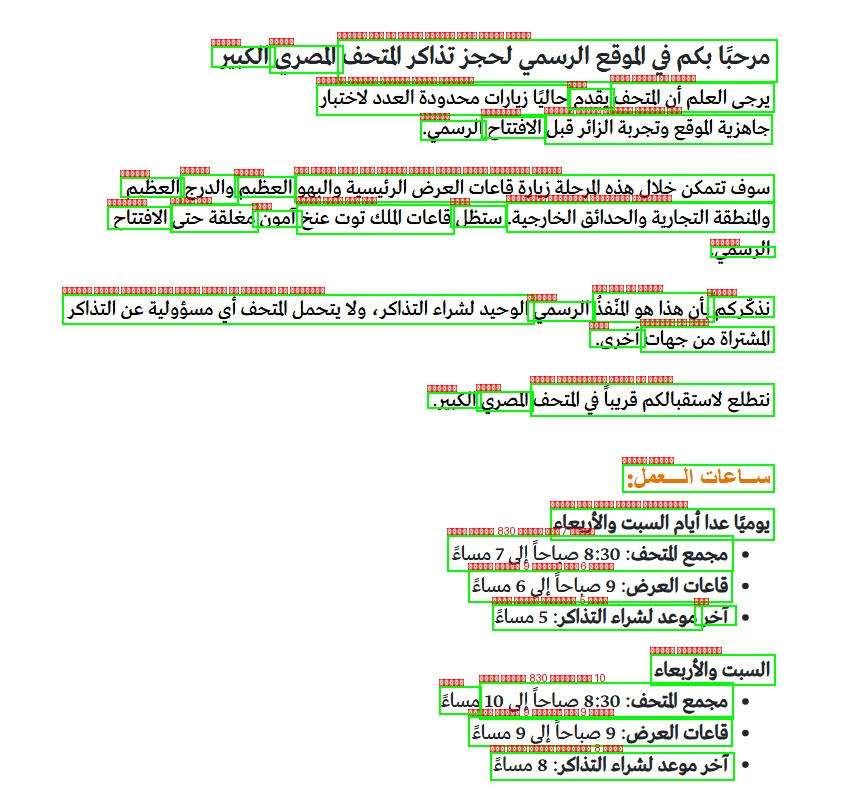
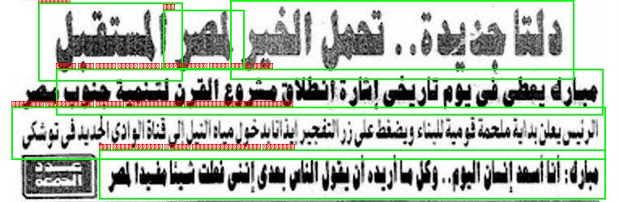

# Arabic OCR Model Comparison App

This project provides a Streamlit application for comparing the performance of **EasyOCR** and **Tesseract** in extracting Arabic text from images. Users can upload an image, and the app will process it using both OCR engines, display the extracted text, and show an annotated image with bounding boxes from EasyOCR.

---

## Features

* **Image Upload:** Easily upload your Arabic text images (PNG, JPG, JPEG).
* **Dual OCR Processing:** Simultaneously process images with both EasyOCR and Tesseract.
* **Text Output:** View the extracted text from each OCR engine.
* **Annotated Image:** See the image with bounding boxes drawn around the detected text by EasyOCR.
* **Text Cleaning:** Automatically cleans extracted text by removing unwanted symbols.
* **Download Results:** Download the extracted text from both models and the annotated image.

---

## How It Works

The application leverages **Streamlit** for the user interface, **EasyOCR** and **Pytesseract** (a wrapper for Google's **Tesseract-OCR Engine**) for optical character recognition, and **Pillow** along with **OpenCV** for image handling. When an image is uploaded, it's processed by both OCR engines. EasyOCR identifies text and its bounding boxes, while Tesseract extracts the overall text. Both outputs undergo a cleaning process to remove unwanted symbols. Finally, the extracted texts are displayed, and EasyOCR's results are used to create an annotated image with visual bounding boxes around the detected text, all of which can be downloaded.

---

## Output Samples

### Image Output Sample



---

### Text Output Sample

**EasyOCR Output:**
مرحبًا بكم في الوقع الرسمي لحجز تذاكر التحف
حاليًا زيارات محدودة العدد لاختبار
يرجى العلم أن التحف
جاهزية الوقع وتجربة الزائر قبل
والدرج
سوف تتمكن خلال هذه الرحلة زيارة قاعات العرض الرئيسية والبهو
مغلقة حتى
قاعات اللك توت عنخ
والمنطقة التجارية والحدائق الخارجية
الوحيد لشراء التذاكر ولا يتحمل التحف أي مسؤولية عن التذاكر
بأن هذا هو النفذ
الشتراة من جهات
نتطلع لاستقبالكم قريبا في التحف
ساعات العمل
يوميا عدا أيام السبت والأربعاء
مجمع للتحف  830 صباحا إلى 7 مساءً
فاعات العرض  9 صباحاً إلى 6 مساءً
موعد لشراء التذاكر  5 مساء
السبت والأربعاء
مجمع التحف  830 صباحا إلى 10
قاعات العرض  9 صباحاً إلى 9 مساءً
آخر موعد لشراء التذاكر  8 مساء
الكبير
امصري
يقدم
الافتتاح
الرسمي
العظيم
العظيم
الافتتاح
آمون
ستظل
الرسمي
نذكركم
الرسمي
أخرى
الكبير
الصري
آخر
مساغً

---

**Tesseract Output:**
مرحبًا بكم في الموقع الرسمي لحجز تذاكر التحف الصري الكبير
يرجى العلم أن للتحف يقدم حاليًّا زيارات محدودة العدد لاختبار
جاهزية الوقع وتجربة الزائر قبل الافتتاح الرسمي

سوف تتمكن خلال هذه المرحلة زيارة قاعات العرض الرئيسية والبهو العظيم والدرج العظيم
واللنطقة التجارية والحدائق الخارجية ستظل قاعات املك توت عنخ آمون مغلقة حتى الافتتاح
الرسمي

تذكّركم بأن هذا هو للنّفذُ الرسمي الوحيد لشراء التذاكرء ولا يتحمل للتحف أي مسؤولية عن التذاكر
للشتراة من جهات أخرى

نتطلع لاستقبالكم قريباً في للتحف اللصري الكبير

ساعات العمل

يوميًا عدا أيام السبت والأربعاء
٠ مجمع للتحف 830 صباحاً إلى 7 مساءً
٠ قاعات العرض 9 صباحاً إلى 6 مساءً
٠ آخر موعد لشراء التذاكر 5 مساءً

السبت والأربعاء ِ
٠ مجمع للتحف 830 صباحاً إلى 10 مساءً
٠ قاعات العرض 9 صباحاً إلى 9 مساءً
٠ آخر موعد لشراء التذاكر 8 مساءً

---

### Image Output Sample



---

### Text Output Sample

**EasyOCR Output:**
الستقبلا
القا ثذباذ  تدهل الفبر
مبارء بعطى فىبوم قربفى إثارة انطلان مثروع الذرن اننبة بجنوب
آربربئرب بمعمةفإباباء إبغندنى واشعبرينانابخا باءالباإرفذاءااىاجابافىنوئى
برء أناأد إمازابا ء زرداب أزبذررالغاردوإمطن ثبادبااه
لهر

---

**Tesseract Output:**
دلا هديدة تحمل الخير اشير المستخيل
مبارك بعظى فى يوم تاريشى إشارة انطلاق مشروع القرن لتحمية حنواب متصر
الرئيس يدان بداية ملحمة قوميةلبناء ويضغط عل زر المتفجيرإيذ انب وز ميا اليل إلى فنا الوادي الجديد ف توشكي

مار أن أسةإنسام اليوم وك ما أري أن يقر الام يعدي إنى نعلت جا لبا كر

---

## Setup and Installation

### Prerequisites

* Python 3.7+
* Tesseract OCR Engine (for Tesseract functionality)

### Installation Steps

1.  **Clone the repository (or download the `OCR_Streamlit_App.py` file):**

    ```bash
    git clone <repository_url>
    cd <repository_name>
    ```

2.  **Install Tesseract OCR Engine:**

    * **Windows:** Download and install from [Tesseract-OCR GitHub](https://tesseract-ocr.github.io/tessdoc/Downloads.html). Make sure to note the installation path (e.g., `C:\Program Files\Tesseract-OCR`).
    * **macOS:** `brew install tesseract`
    * **Linux:** `sudo apt-get install tesseract-ocr`

3.  **Create a virtual environment (recommended):**

    ```bash
    python -m venv venv
    source venv/bin/activate  # On Windows: venv\Scripts\activate
    ```

4.  **Install the required Python packages:**

    ```bash
    pip install streamlit easyocr opencv-python Pillow pytesseract numpy
    ```

5.  **Update Tesseract Path (if on Windows):**
    Open `OCR_Streamlit_App.py` and ensure the `pytesseract.pytesseract.tesseract_cmd` variable points to your Tesseract executable. For example:

    ```python
    pytesseract.pytesseract.tesseract_cmd = r"C:\Program Files\Tesseract-OCR\tesseract.exe"
    ```

---

## How to Run the Application

1.  **Navigate to the project directory** in your terminal.
2.  **Run the Streamlit application:**

    ```bash
    streamlit run OCR_Streamlit_App.py
    ```
    This will open the application in your default web browser.
